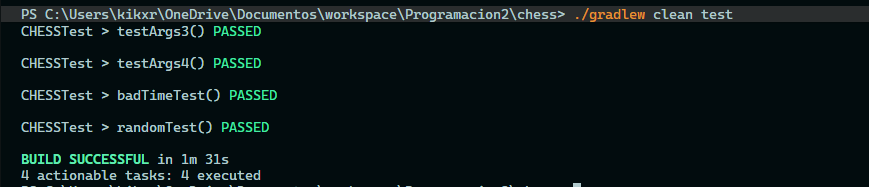

# CHESS

## Ejecución

Para ejecutar el programa, se debe correr con gradlew. Para ello, se debe correr el siguiente comando en la terminal, por ahora solo se puede correr los tests.
> Argumentos:
> - `-a`: Algoritmo a usar
> - `-t`: Tipo de pieza (Numero o Letra)
> - `-o`: Color de las piezas
> - `-in`: Si desea incluir solo piezas llamadas en `r`
> - `-r`: Cantidad de piezas a incluir
> - `-s`: Cantidad de ms de espera entre iteraciones

##### Ejemplo
```bash
"a=s", "t=n", "o=b", "in=r", "r=16", "s=100"
```

## Terminal

Use el comando 
```bash
javac app\src\main\java\com\chess\*.java app\src\main\java\com\chess\utils\*.java app\src\main\java\com\chess\algorithms\*.java app\src\main\java\com\chess\enums\*.java
```
para compilar el programa y luego use el comando
```bash
java app\src\main\java\com\chess\Main.java arg1 arg2...
```

## IDE

Para correr el programa en un IDE, se debe correr el archivo Main.java con los argumentos necesarios.

## TEST

Para correr los tests, se debe correr el siguiente comando en la terminal.

```bash
./gradlew clean test
```

### Resultados

Los resultados de los tests es:


## Diagrama

